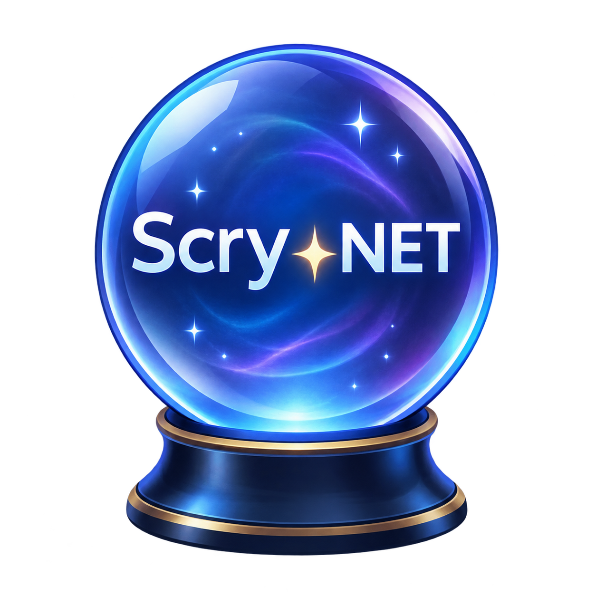
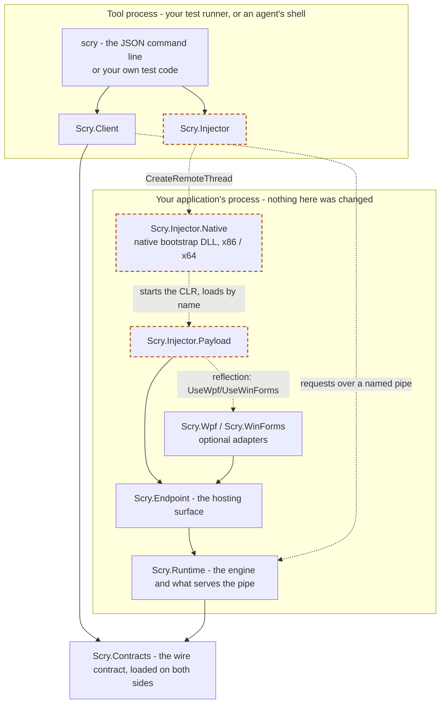
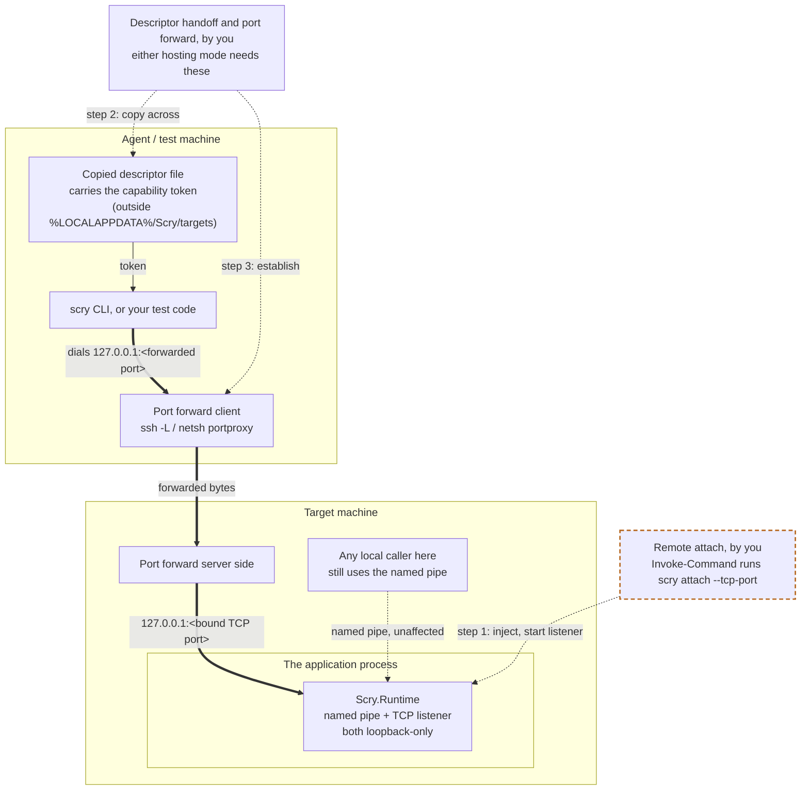

# Scry.NET



**A must-have tool for .NET development in the AI era!**

**Scry.NET gives your .NET application what the DevTools protocol gives a web or Node.js app:
a live, external handle on a process that is already running - built for the two things people
actually need one for. AI agents that must check their own work against the real application
rather than reason about what a change probably did, through the
[agent Skill](skills/scry/SKILL.md) that ships with it. And automated tests that need to reach
past the UI into the state behind it.**

<br clear="left"/>

Connect to a running application and read its actual object graph, write to it, call its methods,
run arbitrary C# inside it, walk its WPF or WinForms tree, and wait on or assert conditions - all
from outside the process, over a versioned JSON protocol on a local named pipe. Not a log, not a
snapshot, not a debugger stopping the world: the application keeps running while you ask it
questions and it answers.

**It is not only for UI applications.** A console host, a Windows service, a background worker or
an API process is a first-class target: `wait` and `assert` evaluate C# rather than inspect a
control tree, so they work where there is no UI at all. The desktop adapters are optional extras,
not the point. See `samples\Scry.SampleWorker` and `samples\Scry.SampleHost`.

**And one agent, or one test, can hold several processes at once.** `scry scenario` runs a list of
commands in which each one names its own target, sequentially or concurrently, and `ScryClient` can
keep connections to several endpoints open together. So a single run can click the button in the
desktop client and then assert - in the server process - that the request actually arrived and the
record actually changed. End-to-end across the tiers, in one flow, with no log scraping in between.
Those processes do not all have to be on one machine: an endpoint can opt into a loopback TCP
listener reachable through a port forward, so the same flow spans the desktop client here and the
server component on the box where it actually runs. See
[reaching an endpoint on another machine](#reaching-an-endpoint-on-another-machine).

It works on .NET 8+ and .NET Framework 4.6.2+, on Windows, x86 and x64. See
["Target framework floors"](docs/development.md#target-framework-floors) for why these are the
lowest versions actually supported, not an arbitrary round number.

## Two ways to get an endpoint into a process

**Attach - inject into a process that has never heard of Scry.NET.**

```powershell
scry attach MyApp --adapters wpf
```

`scry` is the library's command line, and `scry attach` is how injection is performed - the same
command an agent runs, and the same one a test can shell out to or call in-process through
`AttachService`.

Nothing in your application changes. No package reference, no startup hook, no
`#if DEBUG` block, no initialization order to get right - and therefore nothing to review, nothing
to accidentally ship, and no chance of the tooling altering the behaviour you are trying to observe.
You point it at a process that is already running, including a Release build, and it is
instrumented a second later. This is the mode most people want.

**Embedded - the application hosts the endpoint itself.**

```csharp
using var host = EndpointHost.Start(builder => builder
    .RegisterRoot("orders", () => orderState, "Current order processing state."));
```

Here the application references `Scry.Endpoint` and decides exactly what is exposed: named,
described roots, values and operations, each tagged with policy such as `IsReadOnly` or
`RequiresConfirmation`. An agent meets a designed surface with documentation attached rather than
raw reflection over your internals, dangerous operations announce themselves as dangerous, and the
application controls whether the endpoint exists at all.

It also reaches things attach mode cannot. Attaching can only start from an object something
*static* points at - a static field, a singleton, `Application.Current` - because there is no
heap-walking operation. An object held only in a local variable or handed out by a dependency
injection container has no such path. Registering it closes over the reference directly, so it
becomes addressable by name. See [Embedded host](#embedded-host) for a worked example.

**Both modes converge on the same `EndpointHost.Start`.** The protocol, every operation, the CLI and
the Skill are identical either way, so the choice is about deployment, not capability.

## Two ways it gets used

**An AI agent validating its own work.** An agent that just changed code can check the running
application instead of reasoning about what the change probably did - read the live state back,
confirm the dialog really closed, see the value the view model actually holds. The workflow lives in
[`skills/scry/SKILL.md`](skills/scry/SKILL.md).

**Automated tests that reach further than conventional UI automation.** Conventional UI automation
sees only what the accessibility tree exposes, identifies controls by position or automation id, and
cannot read a view model or call a service. A Scry.NET test can drive the real controls *and* assert
against internal state in the same run. Because `evaluate` and `execute` compile against the
assemblies already loaded in the target, a renamed property fails as a compile error with a
diagnostic rather than as a silent mis-click that passes.

## It in action

The same flow - attach to an app, fill in a login dialog, click the button, wait for the main
window, then read the UI tree back and capture a screenshot - written both ways.

### As a test would, in C#

```csharp
// Attach to a running application that has never heard of Scry.NET.
var attach = await AttachService.AttachAsync("MyApp", alias: "app", adapters: "wpf");
await using var client = await ScryClient.ConnectAsync(attach.Descriptor!);

// Type into the real PasswordBox, on the UI thread that owns it.
await client.ExecuteAsync(new ExecutionRequest(
    """
    var box = (System.Windows.Controls.PasswordBox)
        System.Windows.Application.Current.MainWindow.FindName("Password");
    box.Password = Environment.GetEnvironmentVariable("APP_TEST_PASSWORD");
    """,
    Marshal: ExecutionMarshalTargets.UiThread));

// Clicking is a separate submission on purpose: a binding updates on a later dispatcher turn,
// so clicking in the same submission would send the password the screen held *before* the line
// above - silently, with no error.
await client.ExecuteAsync(new ExecutionRequest(
    """
    var button = (System.Windows.Controls.Button)
        System.Windows.Application.Current.MainWindow.FindName("LoginButton");
    var peer = System.Windows.Automation.Peers.UIElementAutomationPeer.CreatePeerForElement(button);
    var invoker = (System.Windows.Automation.Provider.IInvokeProvider)
        peer.GetPattern(System.Windows.Automation.Peers.PatternInterface.Invoke);
    invoker.Invoke();
    """,
    Marshal: ExecutionMarshalTargets.UiThread));

// Wait for the main window, then read the whole visual tree back as JSON.
await client.RequestAsync("wait", new
{
    source = """
        System.Windows.Application.Current.Windows.Cast<System.Windows.Window>()
            .Any(w => w.GetType().Name == "MainWindow" && w.IsVisible)
        """,
    timeoutMilliseconds = 60_000,
    marshal = "ui"
});

// Read the structure back as JSON, and take a picture of it. Different questions: the
// snapshot says what the tree contains, the screenshot says what it looked like.
var tree = await client.RequestAsync("wpf.snapshot", new { });

var shot = await client.RequestAsync("wpf.screenshot", new { });
var png = shot.Result!.Value.GetProperty("base64Data").GetString();
File.WriteAllBytes("login-failed.png", Convert.FromBase64String(png!));
```

### As an agent would, through the CLI

```powershell
scry attach MyApp --alias app --adapters wpf
scry execute --target app --request set-password.json
scry execute --target app --request click-login.json
scry wait --target app --request main-window.json
scry wpf.snapshot --target app --request empty.json
scry wpf.screenshot --target app --request empty.json
```

Each request file holds the same JSON the C# above builds - for example `set-password.json` is
`{"source": "...", "marshal": "ui"}`. Requests come from files or stdin rather than inline
arguments, deliberately: it keeps source and credentials off the command line, off the process
list and out of shell history. `empty.json` really is just `{}` - both snapshot and screenshot
default to the application main window, which matters when attached, because an injected target
has no registered roots to name. The screenshot comes back as base64 PNG in `base64Data`.

The CLI is a thin client over the same protocol as `ScryClient`, so neither audience can do
anything the other cannot.

## Getting started

There are two primary ways to get started with Scry.NET:

### 1. For AI agents (and CLI use)

The `scry` CLI lets AI agents and developers inspect, mutate, and attach to running .NET applications.

1. **Download the release bundle**:
   Download the self-contained build for your target application's architecture from the [latest release](https://github.com/sdaliyot/Scry.NET/releases/latest):
   - `scry-win-x64.zip` for 64-bit target processes.
   - `scry-win-x86.zip` for 32-bit (x86) target processes.
   
   *Note*: The architecture of `scry.exe` must match the architecture of the target process you wish to attach to (an x64 injector cannot attach to an x86 target and vice versa). If you work with both 32-bit and 64-bit targets, both bundles can be downloaded side-by-side. `scry.exe` is self-contained and needs no separate .NET runtime install.

   *Unsigned binaries*: Windows SmartScreen or antivirus/EDR software may warn on first run. This is expected for an unsigned binary that performs process injection by design; see [`docs/threat-model.md`](docs/threat-model.md).

2. **Configure your environment**:
   Make `scry.exe` discoverable by adding its location to your environment:
   - If using a single architecture, add its unzipped folder to your system `PATH`.
   - If using both architectures or keeping them in separate directories, define the corresponding environment variable(s):
     - `SCRY_HOME_X64` pointing to the directory containing 64-bit `scry.exe` (e.g. `C:\scry-win-x64`)
     - `SCRY_HOME_X86` pointing to the directory containing 32-bit `scry.exe` (e.g. `C:\scry-win-x86`)

3. **Install the Skill in your AI agent**:
   - **Claude Code**: Install the Skill directly:
     ```text
     /plugin marketplace add sdaliyot/Scry.NET
     /plugin install scry@scry-plugins
     ```
   - **GitHub Copilot, OpenAI Codex, Cursor, etc.**: Paste the contents of [`skills/scry/SKILL.md`](skills/scry/SKILL.md) into your agent's instructions (e.g. `AGENTS.md`, `.cursorrules`, or custom agent instructions).

4. **Prompting your AI agent (example usage)**:
   Scry is designed for scenarios where an agent should verify its work against the real running application rather than guessing from source code or waiting for manual UI verification. Example prompt:
   > *"I just refactored the discount calculation in `CheckoutViewModel.cs`. Please launch or attach to `CheckoutApp`, add two items to the shopping cart, and use Scry to verify that the total discount displayed on the screen and in the ViewModel state matches 15%."*

   The agent will discover or attach to the process via `scry attach`, interact with UI controls or internal state, and assert expected behavior. See [As an agent would, through the CLI](#as-an-agent-would-through-the-cli) above for the step-by-step command flow.

### 2. For automated tests

Automated test suites can interact with Scry.NET endpoints either via NuGet or direct reference:

1. **Connect to endpoints using NuGet**:
   `Scry.Net.Contracts` and `Scry.Net.Client` are published to nuget.org for both .NET 8+ and .NET Framework 4.6.2+:
   ```powershell
   dotnet add package Scry.Net.Client
   ```
   This provides `ScryClient`, `ExecutionRequest`, and everything needed to connect to and drive an endpoint over named pipes or TCP.
   *(Alternatively, if you prefer not to use NuGet, reference `Scry.Client.dll`, `Scry.Contracts.dll`, and `scry-injector.dll` directly from the release zip's `lib\net` or `lib\netfx` directory).*

2. **Attaching in tests**:
   `Scry.Net.Client` connects to already-running endpoints. If your test suite needs to *attach* to an uninstrumented target process, use the downloaded `scry.exe` CLI:
   - Resolve `scry.exe` from `PATH` or the configured `SCRY_HOME_X64` / `SCRY_HOME_X86` environment variables.
   - Shell out to `scry attach <pid>` before connecting with `ScryClient` (this is the recommended, no-build approach).

   *See [As a test would, in C#](#as-a-test-would-in-c) above for an end-to-end example demonstrating launching, attaching, clicking controls on the UI thread, and asserting internal state in C#.*

---

*Advanced: Building from source* — If you need to modify or rebuild the native injector, adapters, or payload assemblies, see [`docs/development.md`](docs/development.md). Running `dotnet publish src\Scry.Cli` produces the same attach-capable layout as the release zips.

## Architecture

The question that matters most is which assemblies end up inside your application. In attach mode
that is `Scry.Injector.Payload`, `Scry.Endpoint`, `Scry.Runtime` and `Scry.Contracts` - plus one
desktop adapter if you asked for one. Everything else stays in the tool process.



Solid arrows are compile-time references. Dashed arrows are resolved at runtime by name - the
native export, the payload entry point and the adapter extension methods are all located by string,
so renaming one breaks attach silently rather than at build time.

The pipe arrow points one way on purpose. The protocol is strictly request and response: the target
never initiates a message, and the frame envelope has no way to express one. Even `job.wait` is a
long poll - the client asks, the target replies late, and the reply carries a `timedOut` flag so the
client knows to ask again. Nothing is pushed.

The three boxes with a dashed orange border exist only for attach mode. Embedded mode is this
picture without them: your application references `Scry.Endpoint` directly and calls
`EndpointHost.Start` itself, so nothing needs injecting and the injector, the native bootstrap and
the payload never enter the story. Everything undashed is common to both modes.

The driving box says "or your own test code" because a test does not shell out to the CLI - it
references the same two assemblies the CLI is built from: `Scry.Injector` for
`AttachService.AttachAsync`, and `Scry.Client` to connect once attached. That is why
`Scry.Injector` has a .NET Framework leg built as a library rather than an executable.

| Component | Runs in | Responsibility |
|---|---|---|
| `Scry.Contracts` | both | The wire contract: request/response records, value projections, framing, descriptors. The only assembly both sides share. |
| `Scry.Runtime` | target | The engine. Owns the named-pipe server, the discovery descriptor, sessions and leased handles, reflection, and the Roslyn scripting host. The only project that references the C# compiler. |
| `Scry.Endpoint` | target | The hosting surface. `EndpointHost.Start`, the registration builder, and runtime registration changes. Where both modes meet. |
| `Scry.Injector.Payload` | target | Attach-mode beachhead. Loaded by the native bootstrap, decodes its configuration, wires any requested adapter, and calls `EndpointHost.Start`. Exists only to be injected. |
| `Scry.Wpf`, `Scry.WinForms` | target | Optional adapters adding `wpf.*` / `winforms.*` tree projection, waits, assertions and screenshots, and the UI-thread marshaller. |
| `Scry.Client` | tool | The connecting client: opens the pipe, performs the handshake, and sends requests. References only `Scry.Contracts`. |
| `Scry.Injector` | tool | Inspects the target's architecture and CLR, refuses unsafe or ambiguous cases, and performs the injection. |
| `Scry.Cli` (`scry`) | tool | The stateless JSON command line, and the interface agents use. |
| `Scry.Injector.Native` | target | Native DLL injected into the target, where it starts the CLR - `ExecuteInDefaultAppDomain` on .NET Framework, `hostfxr` on modern .NET - and calls the payload. The injector also maps a local copy, but only to compute the export offset before rebasing it into the remote module; it executes only in the target. |

`Scry.Client` depending on `Scry.Contracts` alone is deliberate. `Scry.Runtime` is the sole carrier
of `Microsoft.CodeAnalysis.CSharp.Scripting`, so keeping the client off it is what lets a test
project reference Scry.NET without pulling roughly ten megabytes of compiler into its output.

| Component | Supported targets |
|---|---|
| `Scry.Contracts`, `Scry.Runtime`, `Scry.Endpoint`, `Scry.Client` | .NET 8+ and .NET Framework 4.6.2+ |
| `Scry.Wpf`, `Scry.WinForms` | .NET 8+ (Windows) and .NET Framework 4.6.2+ |
| `Scry.Cli` | Modern .NET only (built against .NET 8); it connects to either runtime |
| `Scry.Injector`, `Scry.Injector.Payload`, native bootstrap | The injector runs on modern .NET or .NET Framework and attaches to x86 or x64 processes on either runtime. Both architectures are verified end to end, each with its own architecture-matched injector. |

## Attaching to a process that does not reference Scry

```powershell
scry attach <pid-or-process-name> [--alias <name>] [--adapters wpf|winforms] [--tcp-port <port|0>] [--targets-dir <path>] [--appdomain <id|name|auto>]
```

The command inspects the target, injects the endpoint, waits for its discovery descriptor, performs
a real protocol handshake, and prints structured JSON without exposing the capability token. Build
the architecture-matched native helpers first, as described in
[`docs/development.md`](docs/development.md).

Pass `--adapters wpf` (or `winforms`) to wire the matching desktop adapter inside the target;
see [Optional desktop adapters](#optional-desktop-adapters) for what that adds and why it is not
automatic. The adapter needs no cooperation from the application - it discovers
`Application.Current.Windows` and reuses the target's existing dispatcher.

## Reaching a chosen AppDomain

Injection always lands in the target's default AppDomain - the one place a managed foothold can be
established without the target's cooperation. For a plain console host or worker that is usually
the whole process, but an ASP.NET application under IIS, for one concrete example, keeps its own
code in a *separate* AppDomain from the worker process's default one; attaching normally leaves an
operator able to confirm the process is running and nothing about the application inside it.

```powershell
scry attach <pid> --appdomain <id|name|auto>
```

`<id>` is a numeric `AppDomain.Id`. `<name>` matches a domain's `FriendlyName` exactly, or as a
*prefix* - useful because an ASP.NET application domain's name carries a volatile trailing sequence
that changes on every recycle (`/LM/W3SVC/2/ROOT-1-134341132053660838`), while the leading
`/LM/W3SVC/2/ROOT` - its actual, stable application id - does not. `auto` picks the single
non-default domain when there is exactly one, and otherwise the default, rather than guessing among
several.

The endpoint's own process gets exactly one native injection for its whole lifetime, so a selector
that cannot be honoured - it matches no domain, or several - does not fail the attach: the endpoint
starts in the default domain instead, and the attach result's `target.appDomainSelectionWarning`
says why. Once *any* endpoint is attached, reach the other domains without spending that injection
again:

```powershell
scry appdomain.list --target my-app --request '{}'
scry appdomain.start --target my-app --request '{"selector":"/LM/W3SVC/2/ROOT"}'
```

`appdomain.list` reports every AppDomain in the process and which ones already host an endpoint;
`appdomain.start` marshals a sibling endpoint into the chosen one and returns its own alias
(`<current-alias>-appdomain-<id>` unless you name one), ready for `--target`. Both operations, and
`--appdomain` itself, only exist on .NET Framework attaches - injection into modern .NET always
targets `CoreCLR`'s single AppDomain, so there is nothing to select between.

This is COM interop (`ICorRuntimeHost`), not a native-bootstrap change: the payload already has a
managed foothold in the default domain, and from there `EnumDomains`/`NextDomain` hand back real,
live `System.AppDomain` references to every domain in the process. See
[`docs/threat-model.md`](docs/threat-model.md) for what this does and does not change about the
trust boundary.

## Embedded host

Register the smallest intentional surface an agent needs. Root factories are evaluated per request, registered values retain a stable object, and operation descriptions and policy metadata are returned by `capabilities`:

```csharp
using var host = EndpointHost.Start(
    builder => builder
        .RegisterRoot("orders", () => orderState, "Current order processing state.")
        .RegisterValue("service.name", "checkout", "Stable service identity.")
        .RegisterOperation(
            "orders.reprocess",
            ReprocessOrder,
            "Reprocesses one order.",
            new OperationPolicy { RequiresConfirmation = true }),
    new EndpointOptions { Alias = "checkout-worker" });
```

### Reaching objects nothing static points at

This is what embedded mode can do that attaching cannot. `samples\Scry.SampleWorker` opens like
any ordinary program:

```csharp
var state = new WorkerState();                 // a local in Main
var worker = RunWorkerAsync(state, stopping.Token);   // passed by parameter, and that is all

await using var host = EndpointHost.Start(builder => builder
    .RegisterRoot("worker", () => state, "Live queue worker state."));
```

Nothing static refers to `state` - no static field, no singleton, no container. An attached endpoint
could not get to it from any direction, because reaching an object means walking to it from
something named, and there is no operation that walks the heap looking for instances.

Registering it closes over the reference, and from then on it is simply `worker`: `scry inspect
--target scry-worker-sample` reads its members, `get` and `set` reach its fields. The same applies to a
service resolved from a dependency-injection container, a per-request context, or any object whose
lifetime is a local one.

The factory form matters here. `RegisterRoot` takes a `Func<object?>` evaluated per request, so
registering something that gets replaced - a current session, a reloaded configuration - always
reads the current one rather than pinning whichever instance existed at startup.

Each registered operation reports `executionPolicy` (`worker-thread` or `ui-owner`), `isReadOnly`, and `requiresConfirmation`. These fields document the handler's contract; `ui-owner` means the handler or adapter performs the required marshalling, not that the core runtime guesses a dispatcher. Agents should call `roots` and `capabilities` first, prefer described read-only operations, request approval before confirmation-required operations, and avoid raw reflection mutation when a named helper exists.

Runtime registration changes are atomic:

```csharp
host.Registrations.RegisterValue(
    "feature.flags",
    refreshedFlags,
    "Current feature flags.",
    RegistrationMode.ReplaceExisting);
host.Registrations.UnregisterOperation("orders.reprocess");
```

Duplicate registration throws unless `ReplaceExisting` is selected. Replacement affects subsequent lookups; existing leased references remain valid until released or expired. Unregistration is idempotent through its `bool` result and does not revoke already leased objects or stop an operation/job that has already started.

## Optional desktop adapters

Reference only the adapter used by the target application, then register it while configuring the embedded host:

```csharp
using var host = EndpointHost.Start(builder => builder.UseWpf(
    Application.Current,
    wpf => wpf.RegisterWindow("main", Application.Current.MainWindow)));
```

```csharp
using var host = EndpointHost.Start(builder => builder.UseWinForms(
    mainForm,
    winForms => winForms.RegisterRoot("main", mainForm)));
```

In attach mode `--adapters` does the same thing reflectively. It is explicit rather than automatic
because without an adapter an attached endpoint has only the framework-neutral surface: `wpf.*`
operations are absent, and `evaluate`/`execute` cannot use `"marshal": "ui"` - which means they
cannot touch a `DependencyObject` or a `Control` at all.

The adapters register `wpf.*` or `winforms.*` snapshot, wait, assertion, and screenshot operations as read-only, `ui-owner` helpers. Their projections are deliberately bounded and framework-specific. WPF visual and logical trees are separate views; WinForms exposes managed controls, open/owned forms, tool strips and menus, and bindings. Neither adapter claims to represent owner-drawn pixels, WebView2/ActiveX content, native child windows, popups/separate HWNDs, or out-of-process surfaces completely.

## Waiting and asserting

`wait` and `assert` evaluate a C# expression and compare its result, with operators `isTrue`
(the default), `equals`, `notEquals`, `contains`, `isNull` and `isNotNull`. They are
framework-neutral, so they work in a console, service or worker target that has no UI tree at all,
and they can assert on application state that the `wpf.*`/`winforms.*` conditions cannot see,
because those only observe the bounded UI-tree projection.

```powershell
scry wait --target app --request wait-loaded.json
scry assert --target app --request assert-count.json
```

`wait` polls until the condition holds or `timeoutMilliseconds` elapses, and reports a timeout as a
successful response carrying `satisfied: false` - read the flag, do not infer it from the exit code.
Repeating a submission reuses its compiled script, so polling costs about the poll interval rather
than a recompile per attempt; `evaluate`/`execute` results carry `compilationCached` to distinguish
a reused script from a cold compile.
`assert` evaluates once and fails the request with `assertion_failed` and a description of the
comparison. Use `wait` to gate, `assert` to fail.

## Reaching UI-owned state

WPF and WinForms objects have thread affinity, and requests are served on a non-UI thread. So
`get`, `set`, `invoke`, `inspect`, `enumerate`, `evaluate`, `execute`, `wait` and `assert` all fail
with `InvalidOperationException: The calling thread cannot access this object because a different
thread owns it` when they touch a `DependencyObject` or a `Control`. That is WPF's and WinForms' own
rule, not an endpoint restriction.

Add `"marshal": "ui"` to run on the target's UI thread instead:

```powershell
scry evaluate --target app --request evaluate-title.json
```

Registering `UseWpf` or `UseWinForms`, or attaching with `--adapters`, enables this; a capabilities
response lists `ui-thread-marshalling` when it is available. Without a marshaller the request is
refused with `marshal_target_unavailable` rather than failing later with a cross-thread exception,
and an unrecognised target is refused with `marshal_target_not_supported`.

Two consequences worth knowing. A marshalled `evaluate`/`execute` **occupies the UI thread** for the
whole submission, so a long-running or looping script freezes the target, and `TimeoutMilliseconds`
cannot interrupt work already running there - keep marshalled submissions short. Such a submission
both *starts* and *resumes* there: a marshalled script that awaits comes back to the UI thread rather
than falling onto the thread pool mid-way. `wait` is the exception by design: it marshals each
evaluation rather than the polling loop, so a long marshalled wait never holds the UI thread between
attempts.

That cooperative limit is why `ScryClient.RequestTimeout` (default 60s; `--timeout` on the CLI)
exists: it bounds only how long the *caller* waits for a reply, not the submission itself. A
script that never observes its cancellation token still occupies the target's thread indefinitely,
but the client now fails with a clear timeout and retires that connection instead of hanging
forever alongside it. `ExecutionResult` also reports `marshalled` and `threadId`, so a caller can
confirm a `"marshal": "ui"` request actually ran on the nominated thread rather than only
inferring it from success.

## Samples

Two kinds. The embedded samples host an endpoint themselves and show what registration looks like
per process style; the attach targets deliberately contain **no** reference to any Scry assembly,
which is the only honest way to demonstrate that attach mode works on an application that is not
cooperating.

| Sample | Process type | Shows |
|---|---|---|
| `samples\Scry.SampleHost` | Console, .NET 8 and 4.6.2 | Set/inspect a counter, run a recalculation job |
| `samples\Scry.SampleWorker` | Long-running worker, .NET 8 | Change queue mode, inspect heartbeats, drain work as a job |
| `samples\Scry.SampleWpf` | WPF, .NET 8 | Update dispatcher-owned editor state, assert projected UI, load as a job |
| `samples\Scry.SampleWinForms` | WinForms, .NET 8 | Update owner-thread order state, assert controls, import as a job |
| `samples\Scry.AttachTarget` | Console, .NET 8 and 4.6.2 | An attach victim with no Scry reference; prints its pid and waits |
| `samples\Scry.AttachWpfTarget` | WPF, .NET Framework 4.6.2 | An uncooperative WPF app with no Scry reference, for `--adapters wpf` |

The embedded samples print `Target` and `Descriptor` on startup and exit cleanly when Enter is sent.
See the development guide for complete adoption and validation flows.

## Using the CLI

Run `scry --help` or `scry help <command>` for examples and the stable exit-code contract.
`scry schema` emits the deterministic machine-readable command, argument, request, result,
and exit-code catalog. Request payloads should come from `--request <file|->` (or
`--input`) and C# source from `--source <file|->` or redirected stdin; agents never need
to put source or secrets on a command line.

`<file|->` means the option takes either a path to read, or the single character `-` to read
standard input instead:

```powershell
scry evaluate --target app --source expression.csx     # read the file
Get-Content expression.csx | scry evaluate --target app --source -
```

One distinction is worth knowing for `evaluate` and `execute`, because the two look alike and mean
different things. Piping in with no option at all treats the input as **C# source**, the same as
`--source -`. Passing `--request -` reads the very same bytes as a **JSON request object**, so that
is the form to use when the submission needs fields alongside the source, such as
`"marshal": "ui"`. Direct `wpf.*` and `winforms.*` CLI commands
translate to their registered structured operations and return their structured adapter
result inline before the ephemeral CLI session closes.

AI coding agents should follow the comprehensive
[`skills/scry/SKILL.md`](skills/scry/SKILL.md) workflow. It covers discovery and safe
target selection, structured inspection before code execution, desktop and non-UI
recipes, waits/assertions, jobs, multi-process scenarios, retries, expected JSON shapes,
and security boundaries.

See [`docs/development.md`](docs/development.md) for the protocol, extension guidance, jobs,
multi-target scenarios and assembly loading.

## Reaching an endpoint on another machine

**The division of labour.** Scry provides direct, session-preserving communication with an
endpoint on another machine, so leased handles and `asReference` workflows keep working across the
boundary. Everything around that is yours: performing the remote attach, transferring the
descriptor and its capability token, and establishing the port forward. Scry does not perform
remote injection, does not distribute credentials, and does not set up tunnels.

The alternative - running the CLI remotely for every request - costs a process start and a
remote-exec round trip per operation, and worse, each invocation gets a fresh ephemeral session, so
a lease taken by one call is gone by the next. A TCP listener plus a port forward fixes that: the
CLI (or your test) runs entirely on the local machine and talks through the forward as if the
target were local.

1. **On the target machine**, get an endpoint running with a TCP listener enabled - by either of the
   [two hosting modes](#two-ways-to-get-an-endpoint-into-a-process).

   *Attaching*, which needs no change to the application but does need to run **on** that machine -
   `Invoke-Command` is the suggested route, since `CreateRemoteThread` is not itself remotable:
   ```powershell
   Invoke-Command -ComputerName target-host -ScriptBlock {
       & 'C:\tools\scry\scry.exe' attach 4812 --tcp-port 0
   }
   ```
   `--tcp-port 0` binds a free loopback port; the attach result's JSON names it (`tcpPort`), never
   the capability token.

   *Embedding*, when you own the application's code - one property on the options you already pass:
   ```csharp
   using var host = EndpointHost.Start(
       builder => builder.RegisterRoot("orders", () => orderState),
       new EndpointOptions { Alias = "checkout-worker", TcpPort = 0 });

   // The actually-bound port, once 0 has been resolved. Also published in the descriptor.
   Console.WriteLine($"Scry listening on 127.0.0.1:{host.TcpPort}");
   ```
   `TcpPort` is `null` by default in both modes, which starts no listener at all - the named pipe
   only. Nothing becomes TCP-reachable unless you ask for it.
2. **Copy the descriptor** from the remote machine (`%LOCALAPPDATA%\Scry\targets\<id>.json`) to the local
   machine, to a path *outside* its own `%LOCALAPPDATA%\Scry\targets` - `Invoke-Command` with `Copy-Item`
   is the suggested route. That file is a bearer credential: whoever holds it can drive the target for the
   rest of the endpoint's lifetime, so delete it once you are done.
3. **Establish a port forward** from the local machine to the target's bound port. `ssh -L
   9000:127.0.0.1:<bound-port> user@target-host` is the shortest route when OpenSSH Server is already
   enabled on the target. Without it, `netsh interface portproxy` does the same job in two hops, using
   nothing but what Windows already ships with:
   ```powershell
   # On the target machine: expose its own loopback Scry port on a routable interface.
   netsh interface portproxy add v4tov4 listenaddress=<target-host-ip> listenport=<bound-port> `
       connectaddress=127.0.0.1 connectport=<bound-port>

   # On the local machine: forward a local loopback port to that.
   netsh interface portproxy add v4tov4 listenaddress=127.0.0.1 listenport=9000 `
       connectaddress=<target-host-ip> connectport=<bound-port>
   ```
   Both directions need admin. Unlike the SSH route, the target-side rule puts the (still
   token-gated) port on a network-reachable interface for as long as the rule exists - worth scoping
   with a Windows Firewall rule to just the calling machine's address in a real deployment, and worth
   removing (`netsh interface portproxy delete v4tov4 ...`, same parameters) once you are done, same as
   the descriptor file above.
4. **Run against it** with `--descriptor` (pointed at the copied file) plus `--address`:
   ```powershell
   scry evaluate --descriptor .\remote-target.json --address 127.0.0.1:9000 --source "1 + 1"
   ```
   `--target <alias>` can never work here: discovery only ever looks at the local
   `%LOCALAPPDATA%\Scry\targets` directory, so it cannot surface a target that lives on another
   machine. `--address` also accepts a bare port (host defaults to `127.0.0.1`) or `auto`, meaning
   "use the descriptor's own published TCP address and port" - useful when there is no forward
   remapping the port. The flagship shape of this is a single `scry scenario` call whose commands
   mix a local `descriptor`/`target` selector with a remote one carrying `address`: drive the
   desktop client here, assert on the server component there, in one flow.

**The trust tradeoff, stated plainly.** A named pipe has an OS-enforced peer check: Windows refuses
the pipe to any user but the one that created it, before a single byte is read. A loopback TCP
socket has no equivalent - any local process, running as any Windows user, can attempt a handshake
against it. The 256-bit capability token is the only gate once TCP is enabled. That is why it is
opt-in and off by default, and why the descriptor - the token's only carrier - must be treated as
what it is: full remote-code-execution-equivalent access to that process, for as long as the
endpoint runs. See [`docs/threat-model.md`](docs/threat-model.md) for the full reasoning.



Legend. **Dashed arrows** are the one-time setup, done by hand once and numbered in the order you do
them. **Bold solid arrows** are the steady-state request path, which runs on every request and
executes *entirely from the agent machine* - the CLI or test dials its own local forwarded port, so
nothing runs remotely per request. That is the whole point: compare it with shelling out to the CLI
on the target machine for every operation.

The **dashed orange border** means the same thing it does in the architecture diagram above:
attach-mode only. Embedding replaces that box - the application starts its own listener via
`EndpointOptions.TcpPort`, so step 1 disappears and only the descriptor handoff and the forward
remain yours to arrange. The named pipe stays available to a local caller on the target machine
throughout, unaffected by the TCP listener.

## Attaching to a service or IIS application pool

A target that runs under a Windows identity with no loaded user profile - an IIS application pool
with `loadUserProfile="false"`, or many service accounts - cannot use the default rendezvous
directory: `Environment.SpecialFolder.LocalApplicationData` resolves to an empty path for such an
identity, so the endpoint has nowhere to publish its descriptor. The same problem shows up, in a
milder form, whenever the target simply runs as a *different* identity than the one attaching -
each identity has its own default directory, so the attaching tool would look in the wrong place
even if the target published successfully.

`--targets-dir <path>` (`RuntimeHostOptions.TargetsDirectory` / `EndpointOptions.TargetsDirectory`
in-process) fixes both: it names an absolute directory both identities can use, instead of each
side computing its own default.

```powershell
scry attach <pid> --tcp-port 0 --targets-dir C:\ScryRendezvous
```

Three things this does not do for you:

- **The directory must already be writable by the target's identity.** Scry never changes
  filesystem permissions; grant access yourself, for example
  `icacls C:\ScryRendezvous /grant "IIS APPPOOL\MyPool":(OI)(CI)M`. If the identities differ and
  access was not granted, `scry attach` reports both identities by name/SID and this remedy in its
  failure message.
- **Every later command needs the same `--targets-dir`**, including `scry discover` - the
  descriptor lives only in the directory it was told to use, not in the default one as well.
- **`--tcp-port` is not optional here.** The named pipe is protected to the identity that created
  it (see [Security, authorization and limits](#security-authorization-and-limits)), so any other
  identity - including this injector - can never open it. `scry attach` tries the pipe first and
  falls back to TCP automatically when the pipe is refused, but the fallback only exists when a TCP
  port was requested; without one, a cross-identity attach has no way to verify at all.

## Security, authorization and limits

See [`docs/threat-model.md`](docs/threat-model.md) for the full reasoning - assets, the trust
boundary, what the audit log does and does not prove, and what is deliberately not defended
against. The summary:

Scry.NET permits deliberate code execution and state mutation inside the target. It is **tooling for development and testing**, not a remote administration service. That is a statement about authorization, not a technical limit: attach works against Release builds as readily as Debug ones, because nothing in the path reads debug symbols - `CreateRemoteThread`/`LoadLibrary` is an operating-system facility, `ExecuteInDefaultAppDomain` is a CLR hosting API, and Roslyn compiles against metadata, which is identical either way. Two differences are worth knowing when targeting a Release build: an obfuscated assembly breaks expressions that name members, and `#if DEBUG` code is absent, so the application itself can behave differently.

**By default every endpoint is local-only, and that default is enforced by the operating system.** Pipe names and tokens are random, and capability tokens are stored only in the current user's rendezvous directory. Modern .NET uses `PipeOptions.CurrentUserOnly`; .NET Framework creates a protected pipe DACL granting only the current Windows SID - so Windows refuses the pipe to any other user before a byte is read, independently of the token.

**Opting into a TCP listener changes that boundary, and only you can opt in.** `TcpPort` is `null` unless set, and it binds loopback only - never a routable address - so the endpoint is still unreachable from another machine without a port forward that you establish. But a loopback socket has no `CurrentUserOnly` equivalent and no DACL: once enabled, any local process running as any Windows user can attempt a handshake, and the 256-bit capability token becomes the only gate. Reaching such an endpoint across machines therefore means the token crosses machines inside the descriptor, which makes that file a bearer credential granting code-execution-equivalent access to the process for as long as the endpoint runs. Treat it accordingly, and delete it when you are done. Do not expose descriptors or bridge the protocol to untrusted clients, and prefer the pipe wherever the caller really is local.

Attach mode is intentionally restricted to processes running at the same or a lower Windows integrity level and requires an injector with the same architecture as the target. It inspects process architecture and loaded CLR modules before writing target memory, refuses unknown/ambiguous runtimes, and reports structured failures for access, loader, bootstrap, duplicate-injection, and likely antivirus/EDR blocking. Injecting code can destabilize the target and commonly triggers endpoint-security controls; use it only on applications and machines you are authorized to test.

Current attach limits are: x86 and x64 only, .NET Framework 4.6.2+ and .NET 8+ only, no ARM64. Injection itself always lands in the target's default AppDomain, but on .NET Framework the endpoint can then be placed in - or a sibling started in - any other AppDomain of that same process (`--appdomain`, `appdomain.list`/`appdomain.start`; see "Reaching a chosen AppDomain" below). On modern .NET, inspection (`list-assemblies`, `find-types`, `describe-type`) already spans every `AssemblyLoadContext`; execution (`evaluate`/`execute`) binds the default context and the runtime's own by default, and can additionally bind a chosen context by naming it in the execution request's `loadContext` field (e.g. one created by `load-assembly --loadPolicy isolated`) - this widens the eligible reference set rather than replacing it, and is rejected on .NET Framework, which has no load contexts.

## Build and test

`.\validate.ps1` runs the full matrix below in one command and stops at the first failure; it is
also what [`.github/workflows/ci.yml`](.github/workflows/ci.yml) runs. To run the steps individually:

```powershell
dotnet build Scry.sln
dotnet test Scry.sln --no-build
dotnet test tests\Scry.Tests\Scry.Tests.csproj -c Release -f net462 --artifacts-path artifacts\net462-x64 -p:PlatformTarget=x64 -- RunConfiguration.TargetPlatform=x64
dotnet test tests\Scry.Tests\Scry.Tests.csproj -c Release -f net462 --artifacts-path artifacts\net462-x86 -p:PlatformTarget=x86 -- RunConfiguration.TargetPlatform=x86
dotnet test tests\Scry.Wpf.Tests\Scry.Wpf.Tests.csproj -c Release -f net462
dotnet test tests\Scry.WinForms.Tests\Scry.WinForms.Tests.csproj -c Release -f net462
```

## License

MIT. See [`LICENSE`](LICENSE). Third-party packages Scry.NET depends on are listed in
[`THIRD-PARTY-NOTICES.md`](THIRD-PARTY-NOTICES.md).
